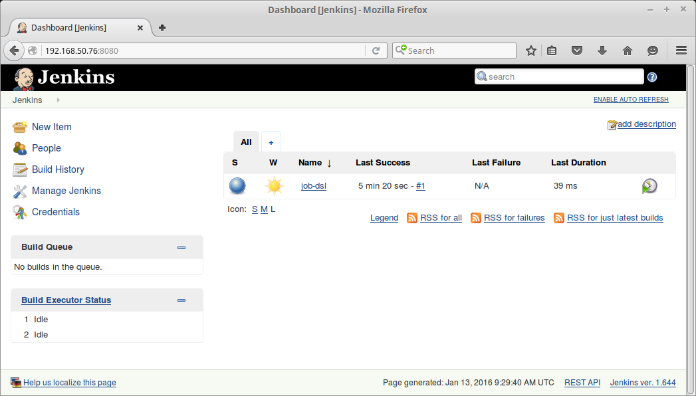

===============================
Installing Jenkins with Ansible
===============================

We want our Jenkins installations to be as reproducible as possible, so our goal is to configure nothing by hand. Instead, we describe the configuration that a server should have and let Ansible_ make the required changes. These descriptions are written in the YAML_ format in files called playbooks_.

Let's create a playbook that tells Ansible that the Vagrant-managed virtual machine should have Jenkins installed. Create a new file called ``jenkins.yml`` in the ``jenkins`` directory with the following contents:

.. code-block:: yaml
   :linenos:

   ---
   - hosts: vagrant
     roles:
       - solita.jenkins

We won't go into details of Ansible playbooks -- for that, see `Ansible's documentation <playbooks_>`__ -- but here's a big-picture view of what each line in the file contains:

1. Begin a new YAML_ document.

2. Configure the server called "vagrant" (that's our virtual machine).

3. Apply some roles_ – reusable pieces of Ansible configuration – to the server.

4. The only role we need is :doc:`solita.jenkins`.

.. note ::

    YAML is very fussy about indentation, so make sure that you indent each line exactly as shown. You should also change your editor to only add spaces and never tabs.

Installing and Updating Roles
=============================

We use the role :doc:`solita.jenkins`, so we need to tell Ansible where it can be found. Create a file called ``requirements.yml`` in the ``jenkins`` directory::

    ---
    - src: https://github.com/solita/ansible-role-solita.jenkins.git
      name: solita.jenkins

.. highlight:: sh

Because Ansible does not officially support Windows, we'll be running it in our virtual machine, so :ref:`connect to it <vagrant-survival-guide>` with ``vagrant ssh``. There you can use ``update-roles.sh`` to install the role::

    c:\> vagrant ssh
    $ ./update-roles.sh

Under the hood the script uses `Ansible galaxy`_ to install role with dependencies.

.. note ::

    If you get a message saying ``[ERROR]: Unable to open requirements.yml``, you may have created the file in the wrong directory. Make sure you have a file called ``requirements.yml`` in the ``jenkins`` directory, next to the ``Vagrantfile``.

    If you get message saying ``-bash: ./update-roles.sh: Permission denied`` the script has `lost execution right`_ somehow. Call ``chmod +x update-roles.sh`` to add the permission to execute the script.

Running the Playbook
====================

Now that we have installed our playbook's dependencies (the :doc:`solita.jenkins` role), you can run the playbook::

    ansible-playbook -i environments/vagrant/inventory jenkins.yml

This will take some time as Ansible has to download some large packages (Java and Jenkins). Unfortunately there's no way to monitor a task's progress in Ansible, so you just have to trust that it's not stuck, even if it's taking a long time.

Once the playbook run is complete, Jenkins should be installed, running, and listening on the virtual machine's port 8080. The virtual machine's IP address is ``192.168.50.76``, so you can access the Jenkins installation with a web browser at http://192.168.50.76:8080/.

.. _Ansible galaxy: http://docs.ansible.com/ansible/galaxy.html#the-ansible-galaxy-command-line-tool
.. _Ansible: http://www.ansible.com/
.. _playbooks: http://docs.ansible.com/ansible/playbooks.html
.. _roles: http://docs.ansible.com/ansible/playbooks_roles.html
.. _YAML: http://docs.ansible.com/ansible/YAMLSyntax.html
.. _lost execution right: http://stackoverflow.com/a/6476550/299101
